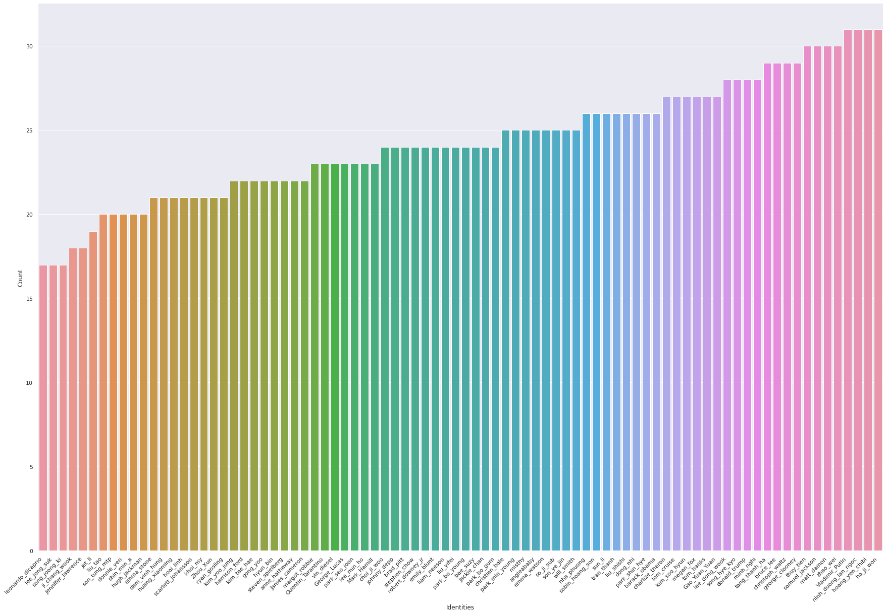

# Face recognition using triplet loss

Keras/Tensorflow implementation of face recognition model using [triplet loss](https://arxiv.org/abs/1503.03832)

## 1. Dataset
### 1.1 Summary
The [dataset](/dataset) including 18 identities (17 and my photo) collected automatically from bing image search, check [download_data.py](./download_data.py) for more details.

### 1.2 Data preparation
#### 1.2.1 Face extraction

Since the images downloaded from bing search is not suitable for training, to train the face recognition, we have to drop the face of each image in the dataset, to accomplish this, [face_recognition](https://pypi.org/project/face-recognition/) module is used to detect face bounding boxes, then we can drop the face to train the face recognizer. However, the module can't detect the face in some images or detect wrong face (we search for Brad Pitt but sometimes we got his wife's face).

#### 1.2.2 Train test split

05 of 18 identities are randomly selected to evaluate the model performance (unseen data). the remains are training data.

## Model
### 1. Using pre-trained FaceNet (WIP)
### 2. Train the model from scratch
- Pre-trained VGG16 is used to extract feature representation. The feature then is normalized using l2 normalization.

#### Result

- The model archive accuracy of `62.75%` on test data
- Visualization of learned face embedding plotted with T-SNE

