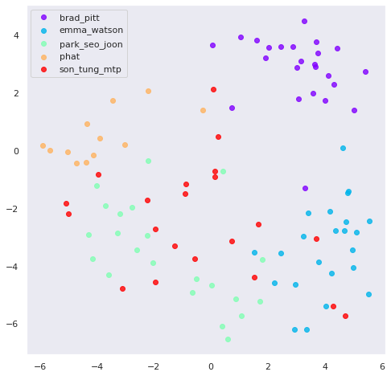

# Face recognition using triplet loss

Keras/Tensorflow implementation of face recognition model using [triplet loss](https://arxiv.org/abs/1503.03832)

## Dataset
The [dataset](/dataset) is collected manually from google image search, we have automated with python script [download_data.py](./download_data.py)

We collected 10 identities with data distribution as follow

<Data distribution image>

### Data preparation

Since the image downloaded from google search may not be usable, to train the face recognition, we have to drop the face of each image in the dataset, to accomplish this, [face_recognition](https://pypi.org/project/face-recognition/) module is used to detect face bounding boxes, then we can drop the face to train the face recognizer. There are some images that could not detect the face.

<Origin data and droped data>

## Model
### 1. Using pre-trained FaceNet (WIP)
### 2. Train the model from scratch
- Pre-trained VGG16 is used to extract feature representation. The feature then is normalized using l2 normalization.

#### Result

- The model archive accuracy of `77.78%` on test data
- Visualization of learned face embedding plotted with T-SNE

